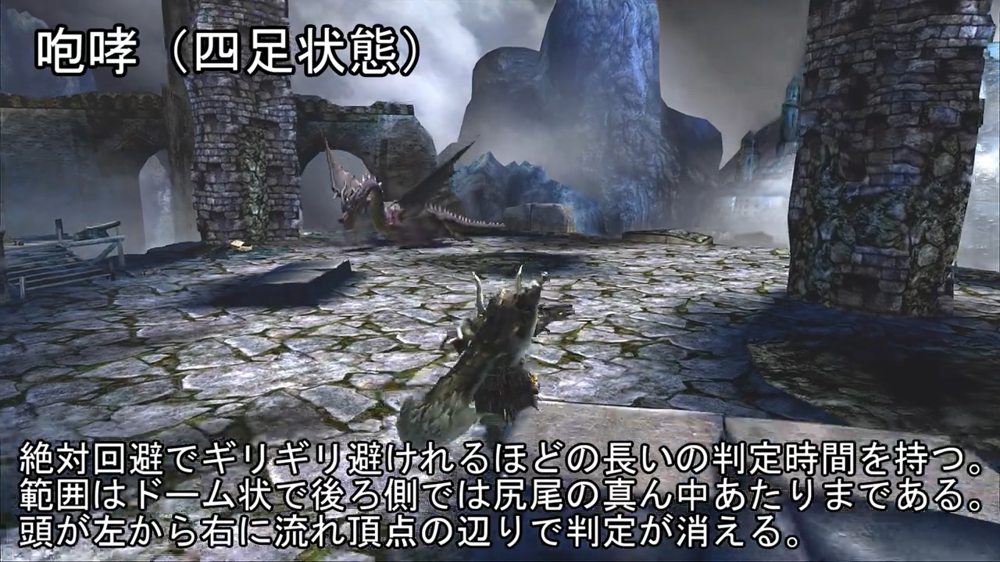
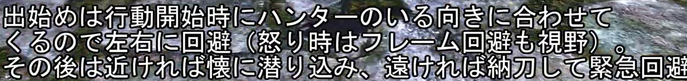
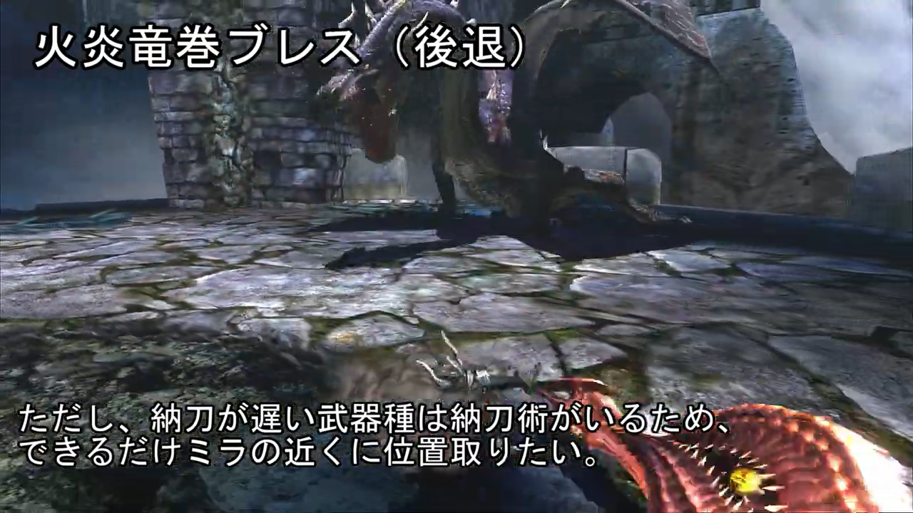
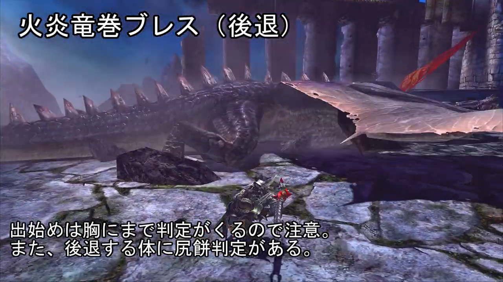
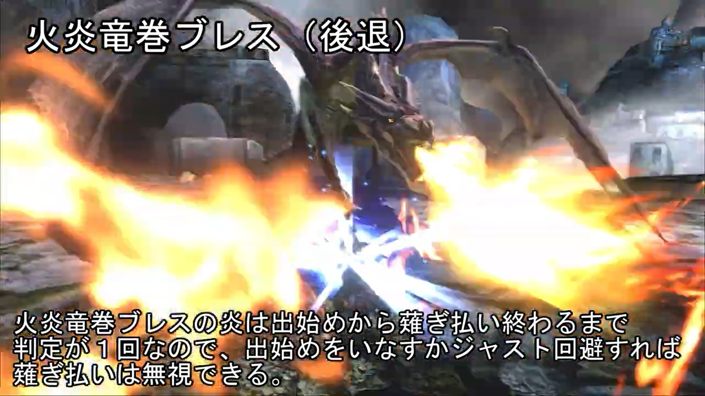
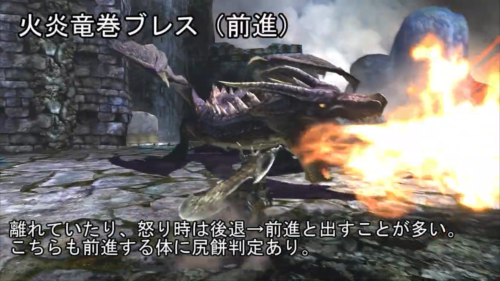
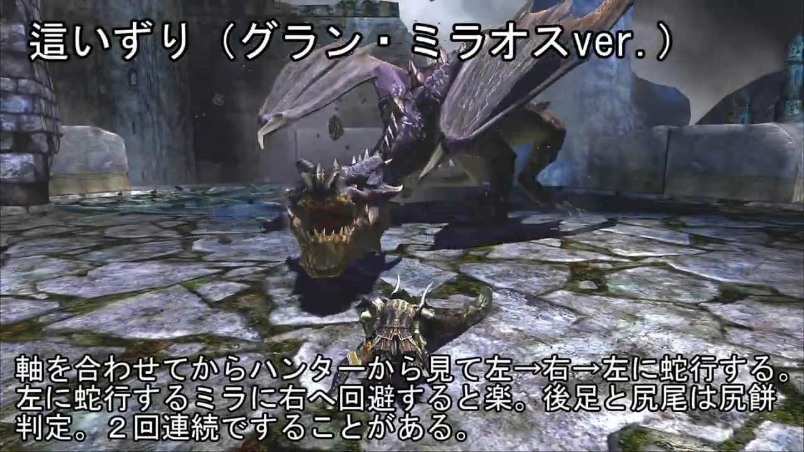
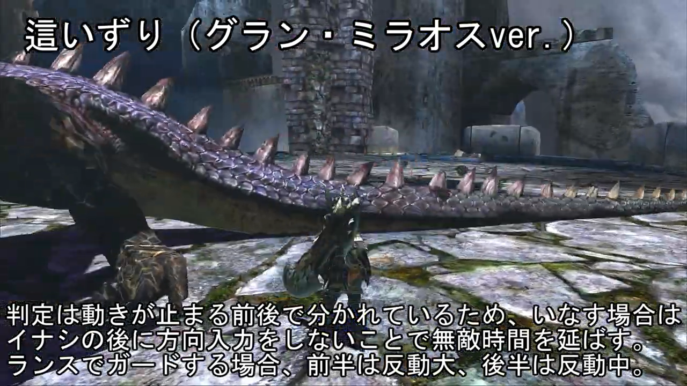

# Subtitles

## 四足姿态

1.  吼
    

    > 四足姿态的吼叫判定时间较长，可以使用绝对回避规避掉。判定范围是一个圆弧状，往后延伸到尾巴中段。头部会从左向右来回摆动，回正到最高点的时候吼的判定消失。

2.  火焰龙卷吐息（后退）

    1. 
       > 一开始会向猎人的方向进行修正，所以可以左右移动进行回避（怒时需要翻滚躲避）。吐息开始后，如果离得近就往身体方向走躲避后续吐息，如果离得远就收刀飞扑。
    2. 
       > 然而，因为收刀速度慢的武器会配纳刀术，所以尽量离黑龙越近越好。
    3. 
       > 注意，吐息动作开始时胸口位置有判定。后退的时候，身体部分有让猎人坐倒的判定。
    4. 
       > 吐息从开始到扫射结束期间只有一次判定。所以如果你一开始就回避了吐息，后面就不会再受到伤害判定。

3.  火焰龙卷吐息（前进）
    

    > 当距离拉远或者黑龙处于愤怒状态时，经常会出现后退吐息接向前吐息。向前吐息时身体部分也会有坐倒判定。

4.  爬行（Grand 黑龙版？）
    1. 
       > 爬行会有一个将身体轴心向猎人修正的对齐动作，然后会以猎人视角的左-右-左的方向蠕动。黑龙向左爬行时（第一动）向右方回避比较好。后脚和尾巴都有坐倒判定。有可能会连续爬行 2 次。
    2. 
       > 爬行动作有前后两段判定，因此使用纳刀回避（Y 回）时，在回避动作触发后不要推摇杆，这样可以延长 Y 回的无敌时间来规避掉两次判定。长枪进行防御时，前半段判定是大退，后半段是中退。
